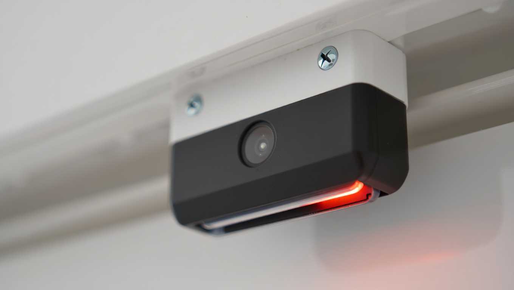

# 3.4 🔍 Discussion and Reflection — Thinking Like a Philosopher

Explore how _perception_ differs between humans and AI systems — not through theory alone, but through short, practical and creative exercises.
Each activity helps translate abstract ideas from **George Berkeley** and **Maurice Merleau-Ponty** into experiences or examples relevant to computing, robotics, and interaction design.

## Activity 1 — Data or Experience?

**Goal:** Differentiate between _processing information_ and _perceiving experience._.   
**Duration:** 5–10 minutes.  
**Format:** Pairs or small groups.   

### Steps

1. Read the following list of examples.
2. Decide whether each is closer to **AI perception** (data, computation) or **human perception** (embodied, experiential).
3. Add to the list

**Examples:**

- Recognizing a cat in an image
- Feeling the cat’s fur
- Detecting sadness in a voice recording
- Feeling sad because of the tone
- Navigating a dark room
- A robot mapping a room with lidar
- ...

### Debrief

Reflect on

> “Where do you draw the line between perception and data processing?”

Then on to:

- **Berkeley’s view:** perception _creates_ the world.
- **Merleau-Ponty’s view:** perception _happens through the body._

## Activity 2 — If the Sensors Go Dark

**Goal:** Apply **Berkeley’s** idea that _“to be is to be perceived.”_.  
**Duration:** 5–8 minutes.  
**Format:** Small groups.  

### Setup

Consider this scenario:

> “Imagine an AI vision system trained on millions of images.   
> One day, it’s turned off — all sensors disconnected, no data coming in.   
> Does its world still exist?”   

### Steps

1. In group write a **two-sentence response**:

   - “Yes, because…” or “No, because…”

2. Use technical reasoning if possible (data storage, model memory, computation).

   - Example: “Yes, its parameters still encode a version of the world.”
   - Example: “No, without active perception, there is no world at all.”

### Debrief

Discuss a few answers. Then connect to **Berkeley**:

> “He believed that when perception stops, the world disappears.
> For AI — does data storage count as ongoing perception?”

## Activity 3 — Embodied or Disembodied?

**Goal:** Experience **Merleau-Ponty’s** idea that perception is _embodied and situated._.   
**Duration:** 7–10 minutes.  
**Format:** Whole class or small groups.  

Choose one of the following formats depending on your space and time.

### Option A – Blind Navigation

1. One student closes their eyes while a partner guides them 3–4 meters using only voice instructions.
2. Swap roles.

**Discuss:**

- How did you perceive distance or direction without vision?
- What replaced your usual sensory information?

### Option B – Touch Recognition

1. Place small objects (USB drive, apple, coin, marker, etc.) inside an opaque bag.
2. Students identify them by touch.

**Discuss:**

- What kind of knowledge did your body provide?
- Could an AI replicate that form of understanding through sensors?

### Option C – Design Analogy

1. Pose the challenge: “Design a robot that must find and pick up a coffee cup in a real room.”

2. Outline (verbally or on paper):

   - What sensors it needs
   - How it would move
   - How it would know it succeeded

**Discuss:**

- “Would this robot _see_ the cup, or would it _feel_ its way to it?”

## 💬 Activity 4 — AI as a Philosopher (LLM Integration)

**Goal:** Use an AI language model (e.g., ChatGPT, Perplexity, Claude) to explore how machines interpret philosophical ideas.   
**Duration:** 10–15 minutes.  
**Format:** Individual or pairs.  

### Steps

1. Open an AI chatbot.

2. Give it one of these prompts:

   - “You are **George Berkeley**. Explain AI perception in your own words.”
   - “You are **Maurice Merleau-Ponty**. What do you think of robots that can feel touch?”
   - “You are an AI philosopher combining both ideas — define _perception_ in one sentence.”

3. Copy or paraphrase 2–3 interesting responses.

4. Then answer these short questions:

   - What does the AI assume about perception?
   - Does it _understand_ or just _recombine_ ideas?
   - Which answer sounds most “human”?

### Debrief

Invite a few to share their favorite “AI philosopher quote.”
Then ask:

> “Did the LLM truly _perceive_ the philosophers’ ideas, or did it just simulate them?”

→ Brings the lesson full circle to your core question:
**Does AI perceive, or does it merely process?**

## 🪜 Recommended Flow (30–35 minutes total)

| Time    | Activity                     | Focus                  |
| ------- | ---------------------------- | ---------------------- |
| 5–7 min | 🧠 Data or Experience?       | Warm-up comparison     |
| 8 min   | 🤖 If the Sensors Go Dark    | Apply Berkeley         |
| 10 min  | 🧍 Embodied or Disembodied?  | Apply Merleau-Ponty    |
| 10 min  | 💬 AI as a Philosopher (LLM) | Synthesis + reflection |

> **Optional closing question:**
> “If perception is what makes a world _real_, what kind of world does AI live in?”